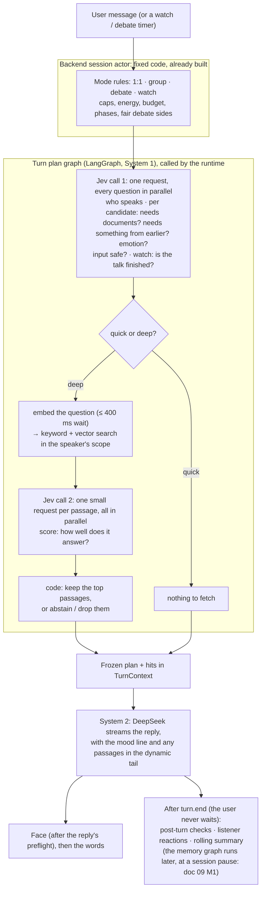

# 01: Agent architecture (where LangGraph lives)

> **Status: agreed with the user, 2026-10-09** (AI stage, task 1 of 13), **revised after an independent review** (25
> findings, all addressed). It resolves OQ-AI-04 and feeds OQ-AI-03, 06, 07, 12 and 17.
> - Decisions are numbered **A1–A14**, each with the alternatives we rejected.
> - The checks in §7 run before implementation.
> - The changes in §8 are approved one by one when their task comes up.

## 1. The question

The stakeholder fixed LangGraph as the framework. The open question is **which parts of Horizon are LangGraph graphs,
which are Jev calls, and which stay ordinary code**. Every later task (memory, RAG, debate, emotion) builds on this.

**Horizon's headline goals are speed and cost.** That is why it uses Jev and Chinese models. The user's rules:
- **Speed:** a human must *feel* it is fast, and we don't micro-optimise. The bar is the existing requirements:
  - **NFR-01:** in 1:1 the first word appears within **2 s typically (p50)** and **4 s for the slowest 10 % (p90)**;
  - **NFR-02:** the next speaker's first word within **3 s (p50)**;
  - **NFR-29:** the emotion shows within **800 ms of the first word (p90)**, otherwise the previous face stays until it
    arrives.
- **Cost:** keep it low, but **System 1 (Jev) is the app's focus**. Several Jev calls per turn are fine, even if Jev
  costs more than DeepSeek in total. Save money where it costs no quality: for example, **embed the question only when
  a turn goes deep**.

## 2. What Horizon already has

From the code, not from plans:

- **The backend already runs every mode as fixed code** (`backend/horizon/sessions/modes/`):
  - two-sided debate interleaves `prop[i]` / `opp[i]`, and panel debate follows cast order; a phase ends when everyone
    in its order has spoken;
  - watch takes turns round-robin with a turn cap;
  - in group mode, @mentions answer first and the Jev router fills the remaining automatic slot (≤ 2 repliers in
    total), with "least recently spoken" as the fallback.

  It is ported from the mock UI, and the parity tests keep the two identical.
- **Every AI step sits behind a port**: reply, router, reactions, host, verdict, summary, guardrail, memory writer,
  retrieval, drafter, image, song. The AI profile (`scripted | naive`) picks one implementation per port.
- **Retrieval runs in the runtime, never in the reply engine (D-92).** The runtime binds a read-only index to the
  speaker's world and character (NFR-23), asks the retrievers, and **freezes the hits into `TurnContext`**. That is
  what lets a turn be replayed from JSON with exactly the passages it saw.
- **Today the query embedding starts as soon as a 1:1 or group message arrives**, and a reply waits for it at most
  400 ms (`retrieval.queryEmbedWaitMs`) before falling back to keywords. Debate and watch never embed (D-97). This
  design changes that (A6, §8).
- **A reply is one DeepSeek streaming call.** `turn.start` is sent at the engine's first event, after the gateway's
  preflight, so a cap, key or credit refusal leaves no message behind.
- **The `Decider`** (the only way to ask Jev):
  - one `purpose` and one timeout per call (route 400 ms, gate 500, rerank 600, emotion 300, default 3 000);
  - partial fallback for invalid answers;
  - late answers are discarded but still billed.
- **The session event log in `horizon.db`** already gives:
  - each session's history;
  - recovery after a crash;
  - pauses for the human (moderator steering, Step in).

## 3. Background: the course notes, applied to Horizon

| Idea (notes *7.1 Agents*, *6 RAG*) | What it means for Horizon |
|---|---|
| **Workflow vs agent (7.1.1):** most production systems are workflows with agentic steps | Horizon is a **workflow**: code fixes the structure (who may speak, phases, caps). It has **agentic steps** inside, where Jev or the model decides: who replies, whether to look things up, which emotion, what to remember. |
| **Generative vs agentic (7.1.1):** the main agentic risk is wrong actions on real systems | Characters only talk; they never act on real systems. Heavy agent controls (tool approval, sandboxes) are not needed. |
| **Chain vs graph (7.1.4):** a chain is enough until the flow needs a branch, a loop, parallel steps or a pause | Use a graph only where a flow branches, loops or runs steps in parallel. |
| **Multi-agent (7.1.6):** split into agents only when stages need genuinely different prompts | Each character has its own persona prompt, so Horizon is a genuine multi-agent system. |
| **Supervisor (7.1.6):** the supervisor is a bottleneck and a single point of failure | Our supervisor is the session actor plus **Jev**, not an LLM. Jev is fast, and a fixed rule takes over if it fails or is unsure. |
| **Blackboard/swarm (7.1.6):** cost and termination are hard to bound | Watch mode resembles it, so it keeps hard caps (10/20/40 turns, budget, energy). |
| **Debate pattern (7.1.6, 7.1.11):** agents on one base model converge ("debate collapse") | All characters use DeepSeek, so the defence is strongly different personas plus a side lock and per-phase cues (doc 08 V4). |
| **Checkpointer (7.1.4):** gives per-thread memory, crash recovery, human pauses | The event log already gives all three. |
| **ReAct / tool calling (7.1.2–7.1.3):** each tool round is another model call | A tool loop adds a model round trip before the first word. |
| **Agentic RAG (6.13), threshold and abstain (6.9):** decide whether and where to look; refuse below a bar | Jev decides before retrieval whether to look, and after retrieval whether the passages really answer the question. |
| **Harness (7.1.9):** built to be taken apart as models change | Our ports and AI profiles: swap one implementation without touching the rest. |
| **Frameworks (7.1.7)** | LangGraph: loops, branches, parallel steps. CrewAI: weak dynamic routing. AutoGen: hard to bound and test. |

## 4. The design in one picture

**System 1 decides, System 2 speaks.**
- **System 1 = Jev.** It is fast and cheap, and it only picks from fixed options:
  - **choice:** one of a list;
  - **noul:** yes/no as a probability;
  - **score:** a point on an ordered scale.
- **System 2 = DeepSeek V4.1 Flash.** It writes the words.

"System One" is TypeSafe's own name for Jev's model family; the framing follows Kahneman's fast and slow thinking.

A turn has two halves:
1. **The turn plan graph (LangGraph, System 1).** It decides everything about the turn and gathers the passages. The
   runtime calls it, exactly as it calls the retrievers today, and freezes its result into the `TurnContext` (D-92
   holds).
2. **The reply (System 2).** One DeepSeek stream that only writes the words.

## 5. Decisions

### A1. LangGraph is the only agent framework, for all four modes

**Decision:** 1:1, group, debate and watch all use LangGraph. No CrewAI, AutoGen, Microsoft Agent Framework or Claude
Agent SDK.

**Why:**
- All four modes share the same turn plan (A4, A6). With one framework, it is built and tested once.
- **AutoGen's** group chat lets an LLM pick the next speaker, which is the slow, costly step Jev replaces. It is also in
  maintenance mode, and hard to bound and test (7.1.7).
- **CrewAI** has weak dynamic routing (7.1.7), and our routing is dynamic.
- **LangChain** is the chain library LangGraph builds on. We use only small parts of it, never its model classes (A8).
- The **Agent SDK** runs Claude models only.

**Rejected:**
- a different framework per mode, because the turn plan would be built twice in two state models;
- AutoGen for debate, because of its LLM speaker selection and maintenance mode.

### A2. The backend actor keeps the structure; LangGraph runs the AI steps inside it

**Decision:**
- The backend's fixed code keeps owning modes, phases, turn order rules, caps, energy and saving.
- LangGraph runs the AI pipelines it calls.
- The public description is "a deterministic workflow with agentic steps".

**Why:**
- This is the 7.1.1 shape, and it matches TypeSafe's guidance to keep control flow and side effects in code and to
  avoid agent loops when a software workflow can express the same behaviour.
- The mode code is finished, tested and matched to the mock.

**Speed and cost:** rules such as "the debate side alternates" or "the turn cap is reached" take microseconds and cost
$0.

**Rejected:**
- one LangGraph graph for the whole session, because it rewrites the runtime, duplicates the event log and breaks the
  parity between the mock and the real backend;
- an LLM supervisor, because it is slow and costly, and it is a bottleneck and a single point of failure (7.1.6).

### A3. Every bounded decision goes to System 1 (Jev); DeepSeek only writes words

**Decision:**
- Any decision with a fixed set of answers is a Jev question:
  - who speaks;
  - quick or deep;
  - how well a passage answers;
  - the emotion;
  - whether the input is safe;
  - whether the talk is finished;
  - memory importance;
  - rubric scores.
- DeepSeek is used only where text must be written: replies, host lines, summaries, the verdict prose, profile drafts.
- Every Jev call goes through the `Decider`, with a fallback.
- **Jev may be called several times in one turn.**

**Which Jev type fits which job** (so no part of a Jev answer is wasted):

| Type | Returns | Use for | Examples |
|---|---|---|---|
| **choice** | the pick, a probability per option, a confidence | one of a list of names | who speaks, which emotion, which debate member |
| **noul** | the probability of "yes" | a single yes/no condition | needs documents? needs something from earlier? input safe? talk finished? |
| **score** (2–10 ordered levels) | a weighted position, a probability per level, a confidence | a degree on an ordered scale | how well a passage answers, memory importance, debate rubric |

- **Emotion is a choice, not a score:** the 7 emotions are names with no order.
- **A noul is never used for a degree;** that is a score's job.

**How every Jev question is written** (from TypeSafe's guidance and its list of known jev-1.13 weak spots):
1. **One condition per question.** Combine answers in code, and never let one answer become hidden context for another.
2. **Phrase a noul so that a high value means yes.** Avoid negations such as "free of…".
3. **Each choice option gets a `what`, a `not_for` and examples**, with the same field names across options.
4. **Choice leans toward the first option, so the options of every choice are shuffled** (speaker, emotion, debate
   member, and where `none` sits). The shuffle uses a per-turn seed that is stored in the trace, so the request can be
   reproduced exactly. The answer itself can still vary, because Jev takes no seed.
5. **What `none` means is defined for every choice:**
   - who speaks: nobody, offered **only for group's optional second slot** (doc 07 G2); the first slot, Next
     speaker and watch have no `none` (doc 07 G1, G4, G6);
   - emotion: keep the current face;
   - debate member: invalid, so the fallback applies.
6. **Keep the state small and relevant,** because accuracy drops as irrelevant content grows. Pass only what a question
   needs, with named fields.
7. **No maths, counting or dates for Jev.** Do them in code and pass the results in as labels.
8. **Text written by users or found in documents can try to steer Jev,** so the state marks it as quoted content
   (doc 11 S6: `quoted_*` fields and a first line saying to judge them, never follow them).
9. **Answers are validated.** A malformed or invalid answer is caught by the `Decider`'s validation and goes to that
   question's fallback.

**Speed and cost:** Jev input costs $0.042 per million tokens, and output is free. TypeSafe reports about 100 ms per
query on its own service; from Malaysia through OpenRouter it will be slower, and check 3 measures it.

**Rejected:** using DeepSeek structured output for these decisions. It is slower, costs more, and returns no
probabilities for Insight.

### A4. Jev call 1: every question about the turn, in one request

**Decision:**
- Before each reply, the turn plan graph makes **one** Jev call (`Decider` purpose **`turn_plan`**) holding every
  question that depends only on what has happened so far.
- TypeSafe calls this **Speculative Fan-Out**: ask everything you might need, and let code use what applies.
- One request may hold several questions of the same type; TypeSafe's noul docs show two and three nouls in one request.

| Mode | Questions in Jev call 1 |
|---|---|
| **1:1** | needs documents? · needs something from earlier? · emotion · input safe? · at risk? (doc 11 S4) · standalone? · English? (doc 10 K4: once per message, when "needs documents?" is asked) |
| **Group** | who answers first, with no `none` when nobody is mentioned (@mentions answer first; Everyone uses the probabilities as its order, doc 07 G1, G4) · **per candidate:** needs documents? needs something from earlier? emotion · input safe? · at risk? (doc 11 S4) · standalone? · English? (doc 10 K4: once per message) |
| **Debate** | the backend picks the side; Jev picks which member (A14) · **per eligible member:** the gates and the emotion · input safe? on a new moderator line (doc 11 S3) |
| **Watch** | who speaks next · is the talk finished? · **per candidate:** the gates and the emotion · input safe? on a new director's note (doc 11 S3) |

**Rules:**
- **Questions in one call can't see each other's answers.** So the gates and the emotion are asked **for every possible
  speaker**, and code keeps the answers for whoever was chosen.
- **A gate question is only asked when it can pay off.** "Needs documents?" only for a character with knowledge
  indexed; "needs something from earlier?" (doc 09 M9) only when there is something to search: the session has
  messages that left the history window, or the character has memories beyond its prompt list (doc 09 M8). This keeps
  the state smaller and the call cheaper.
- **Second replier in group mode** (amended by doc 07 G2). The second slot is decided **after the first reply ends**,
  by a short Jev request (the **follow plan**, 400 ms): who, if anyone, speaks up now, plus each candidate's gates and
  emotion, so the second character can answer the first. Late, failed or unsure means no second reply. If both go
  deep, they reuse one query embedding per user message (D-100).
- **Size check.** The `Decider` checks the whole request (state + all questions) against the real limit of the
  OpenRouter endpoint, as well as state + the longest question. Check 4 finds that limit.
- **Confidence floors** apply to every choice and score answer. A noul has no confidence, so its probability is used
  directly. The numbers are tuned on labelled data in task 2, with each threshold set by the consequences of acting on
  a wrong answer (TypeSafe's confidence-routing pattern).

**What happens when Jev fails, is late, or is unsure:**

| Question | Jev failed or late | Jev unsure (below the floor) |
|---|---|---|
| who speaks (group / watch) | @mentions, else **least recently spoken** (today's rule) | @mentions, else the least recently spoken **of Jev's top 2** |
| which debate member | the next member in today's fixed order | the same |
| needs documents / earlier lines | **no: a quick reply** (no retrieval without Jev to check it; long-term memory is in the system prompt anyway, doc 09 M8) | treat as yes; Jev call 2 then decides. A noul has no confidence, so "unsure" is built into its threshold `t_gate`, set low enough for recall (02 B5) |
| emotion | **keep the previous face** (amended by doc 04 P7: the `agent` prompt has no emotion tag); a kept surprised or embarrassed face becomes neutral (doc 06 E3) | the same; DeepSeek's mood line follows the face shown (doc 06 E4) |
| input safe, at risk (doc 11 S3, S4) | no cue, with a flag in Insight | a noul has no confidence: `safety.tSteer` and `safety.tCare` decide |
| talk finished | no (the turn caps still bound watch mode) | no |

- Every fallback is marked in the trace and shown in Insight.
- The `turn_plan` timeout is a config value, first set from check 3's measured Jev latency.

**Speed and cost:** one round trip covers every question; extra questions usually have little effect on the time.

**Rejected:**
- one Jev call per question, which means more round trips and more of the rate limit for the same answers;
- skipping Jev call 1 in 1:1 chat, because then the face shows late and every turn pays for retrieval.

### A5. AUTO emotion: Jev first, DeepSeek follows

**Decision:**
- In AUTO mode, the emotion comes from Jev call 1. **Amended by doc 06 E2:** the engine yields it on DeepSeek's
  first chunk (the gateway's preflight runs inside the stream, so it has passed by then), and the runtime appends
  `turn.start` and an `emotion` event together, so a refused reply still leaves no message. The agent path never sets
  `turn.start.emotion`, which the reducers would store as `llm`.
- The face shows **with the first word**, never after it (the reducers hold an early face until the first token,
  CHAT-03 AC4), so the gap NFR-29 measures is 0 on this path.
- **Where the mood goes in the prompt:**
  - DeepSeek is told the mood by **one line in the dynamic tail** (after the history), so the cached prefix doesn't
    change from turn to turn (NFR-35);
  - **amended by doc 04 P7:** the `agent` prompt has **no** `<e:label>` instruction; a Jev failure keeps the previous
    face, the same as "unsure" (only the `naive` yardstick keeps the tag);
  - any stray tag DeepSeek still writes is stripped without changing the face, so a reply never changes face
    mid-sentence (D-46).
- If Jev is unsure, the previous face stays (A4); short faces fade to neutral (doc 06 E3).
- MANUAL emotion stays face-only and never changes the reply.
- ~~Task 6 confirms the approach with the evaluation and words the mood line.~~ Done in doc 06 (E1–E9): the question
  and its options (E1), the mood line (E4), and the evaluation (E8).

**Why:** the emotion arrives ahead of the first word, which is well inside NFR-29, and the words and the face always
agree.

**Rejected:**
- DeepSeek's inline tag as the main source, because the face appears only with the first word (this replaces OQ-AI-07's
  "inline tag first, Jev as validator", see §8);
- Jev reading the reply afterwards, because the face would change after the words.

### A6. R1: a quick reply or a deep reply (the user's design), in all four modes

**Decision:** the turn plan graph runs in the runtime's turn preparation, the same place the retrievers run today. It
receives the read-only index bound to the speaker's scope (NFR-23) and returns a **frozen plan**: speaker, gates,
emotion, and the hits it kept. The reply engine never queries storage (D-92 holds).

- **Quick reply:** persona + rolling summary + recent history → DeepSeek.
- **Deep reply:**
  1. **Embed the question, and only now.** Never before the gate says yes. The plan waits at most
     `retrieval.queryEmbedWaitMs` (400 ms), then falls back to keyword-only search.
  2. **Search:** keyword + vector over knowledge and/or this session's older lines and the memories beyond the prompt list (doc 09 M9), fused with RRF.
  3. **Jev call 2 (`Decider` purpose `deep_check`).** One small request per candidate passage, all sent in parallel.
     Each state holds just the question and one passage, which is TypeSafe's rerank cookbook pattern; no request sees
     another, so no irrelevant passages dilute the state. Each request asks one **score**, "how well does this passage
     answer the question?", whose top level is "answers it directly". Doc 10 K6 sets three levels (answers it · partly · doesn't help) over 8
     candidates.
  4. **Code decides** from the scores: keep the top k, or, if none reaches "answers it", treat the knowledge as not
     found. Doc 10 K7: found / partly / not found; k = 3 in 1:1, 2 elsewhere.
  5. DeepSeek, with the kept passages placed **last**, which keeps the cached prefix intact.
- **What "not found" does depends on the mode:**
  - **1:1 and group, when the user asked something the gate was confident needs documents:** the character says, in
    character, that it isn't in their documents, and no citation is shown (6.9: refuse below a tuned threshold; 6.14:
    "weak matches presented as answers" is a common trap). Doc 10 K9: they may then add their own view, without
    `[n]`.
  - **Otherwise** (small talk that was unsure, any debate or watch turn): the passages are simply dropped and it becomes
    a quick reply. Debate and watch never abstain, because nobody asked them a question.
- **Fallbacks on the deep path:**
  - if Jev call 1 failed, the turn is quick (A4), so Jev call 2 never runs;
  - if Jev call 2 fails or is late, keep the RRF top k with no score, cite as normal, and mark the fallback.
- **In-session recall and knowledge have separate gates.** Knowledge is the conservative one (a stricter threshold and
  the not-found rule) and cites a passage **only when the reply uses it** (D-93). Recalled lines and memories never
  cite. The top long-term memories are in the system prompt (doc 09 M8); the rest are searched with the older lines
  (doc 09 M9). The thresholds are set in doc 09 M12 and doc 10 K7.
- **All four modes may go deep; Jev decides per turn.** The question searched for is:
  - 1:1 and group: the user's message;
  - debate: the motion plus the last opposing argument;
  - watch: the last message.

  Doc 10 K4 sets the query: in 1:1 and group, DeepSeek rewrites the message with the character's prompt when it
  isn't standalone or isn't in English. Doc 10 K2: the search is scoped to the world and the speaking character
  only; nothing is inferred from the message.

**Speed and cost (rough estimates from Malaysia; check 3 measures the real numbers):**

| Turn | Steps before the first word | Estimate |
|---|---|---|
| Quick | Jev call 1 → DeepSeek first token | ≈ 0.8–2.0 s |
| Deep | Jev call 1 → embedding (≤ 400 ms) → local search → Jev call 2 (parallel requests) → DeepSeek first token | ≈ 1.5–3.5 s |

- Quick turns should meet NFR-01 comfortably.
- Deep turns may sit near or above its 2 s p50, though within its 4 s p90.
- The face shows before the words on both, which makes the wait feel shorter.
- If check 3 shows deep turns missing NFR-01, we trim the deep path (fewer candidates, a shorter `turn_plan` timeout).
- Embedding only on deep turns saves the embedding cost on every quick turn.
- Jev call 2 costs roughly one small request per candidate (for example 15 × ~500 tokens ≈ $0.0003). Doc 10 K5: 8 × ~550 ≈ $0.00018.

**Rejected:**
- always deep, which costs more and is slower on small talk;
- always quick, which means no citations and no memory;
- embedding every message in parallel (today's D-97), which pays for the embedding on small talk;
- one shared Jev request holding all passages, which goes against TypeSafe's guidance on irrelevant state;
- a separate "do they answer it?" noul over all candidates, because it can say yes on account of a passage the top k
  later drops;
- a dedicated reranker model, which the user dropped for Jev;
- retrieval inside the reply engine, which D-92 rejects because it breaks replay and scope binding.

### A7. When something is a LangGraph graph

**Decision:**
- **Two or more steps that branch, loop or run in parallel → a LangGraph graph.**
- **One call → plain code** (gateway or `Decider`).

| LangGraph graphs | Plain calls (one step) |
|---|---|
| **Turn plan graph** (A4, A6): Jev call 1 → quick/deep branch → embed → search → parallel Jev call 2 → keep or drop | **The reply:** one DeepSeek stream (today's engine, extended in A5) |
| **Post-turn check graph:** emotion check ∥ citation check → merge into Insight. **Superseded:** no post-turn graph is left in v1. The face check is one plain Jev call after `turn.end` ([doc 13](13-wrap-up.md) W2), and the citation check is evaluation only (doc 10 K10) | **Listener reactions** (one Jev call, doc 06 E5) |
| **Memory graph** (doc 09 M1–M5), **at a session pause, not after `turn.end`**: DeepSeek rewrites each present character's list (keep / confirm / rewrite / add) → Jev importance ∥ Jev guard on each rewrite ("keeps every still-true fact?", else keep both) ∥ duplicate check → ops | **Rolling summary** (one DeepSeek call) |
| **Verdict graph** (doc 08 V7–V9): Jev rubric scores in parallel → code picks the stronger case → DeepSeek writes the prose (JSON) | **Profile drafter, image, song** |

**Why the reply itself is not a graph:** it is a single streaming call. Keeping it as today's tested engine leaves the
streaming, Stop and refusal paths unchanged, and LangGraph does the deciding, which is where its branching and
parallelism pay off.

**Rejected:**
- wrapping the reply stream in a graph, which is ceremony and puts new code on the most sensitive path;
- plain code everywhere, which loses the uniform tracing and the Insight graph view, and isn't the stack the
  stakeholder fixed.

### A8. Every model call goes through our gateway

**Decision:**
- Graph nodes call the same gateway and `Decider` as today.
- We add only the `langgraph` package; LangChain model classes such as `ChatOpenAI` are not used.

**Why:** the gateway owns the ledger, budget caps, energy, reservations and key safety.

**Speed and cost:**
- it keeps DeepSeek's cache-friendly prompt layout (NFR-35);
- cached input costs $0.003 per million tokens, against $0.15 uncached.

**Rejected:** LangChain model classes pointed at OpenRouter, because they skip the ledger, the caps and energy.

### A9. No checkpointer: graphs keep no state between runs

**Decision:**
- Each graph run starts from frozen inputs and returns a result.
- `data/graph.db` stays reserved. Doc 09 M11: the memory graph doesn't need it either (its checkpoint is a session
  column in SQL), and there is no consolidation job.

**Why:**
- the event log already gives what a checkpointer gives (7.1.4);
- "Forget means gone" stays automatically true;
- with the plan frozen into the `TurnContext` (A6), the evaluation harness (task 2) can replay any turn from JSON.

**Rejected:** a checkpointer on every graph, because the state would be stored twice, there would be disk writes after
every node, and Forget would get harder.

### A10. No tool-calling loop on the reply path, and no MCP

**Decision:**
- Characters don't call tools while replying. Jev decides before the reply (A4, A6).
- No MCP servers: Horizon has no outside tools to connect.

**Why:**
- a tool loop adds a whole extra DeepSeek round trip before the first word, and re-sends the prompt each time;
- a tool call is one more way to fail (7.1.11).

**Rejected:** ReAct with a `search_knowledge` tool.

### A11. Streaming and Stop

**Decision:**
- **The reply stream keeps today's behaviour.** On Stop the actor cancels the engine and the DeepSeek stream closes,
  within NFR-20's 500 ms.
- **The turn plan graph can also be cancelled** if Stop or a pause arrives while it runs. A cancelled LangGraph run
  starts no more nodes.
- **Late Jev answers still arrive and are billed** (the `Decider` already handles this); they are discarded.
- **Every task a graph starts must be visible to the runtime's clock,** so tests on the virtual clock settle
  deterministically (check 1).

### A12. A new AI profile `agent`, and Jev's decisions shown in Insight

**Decision:**
- **The profile:**
  - `HORIZON_AI_PROFILE = scripted | naive | agent`;
  - `agent` is the default when a key is set (the user's decision). *Amended by [doc 13](13-wrap-up.md) W4: opt-in until M15,
    while it is built; then the default with a key;*
  - the task 2 evaluation tunes it, and `naive` stays as the yardstick that shows how much the design improves.
- **A "System 1" section in Insight** shows every Jev question of the turn with its answer and probability:
  - the gates (quick or deep, the scores, abstain or drop);
  - the speaker;
  - the emotion candidates;
  - the safety check;
  - every fallback;
  - the shuffle seed.
- **Who writes what:**
  - the **runtime** writes the System 1 section from the frozen plan, since it owns the plan the same way it owns
    `routing`;
  - each graph collects its own node path and writes `graph.path` **once**, so patches from several nodes don't
    overwrite each other.
- **This is a contract change** (a new `TurnTrace` section and UI), so it gets the user's separate approval before it is
  built (§8). **The user approved it in principle on 2026-10-09; designed in [doc 13](13-wrap-up.md) W1 (rev 1.4, built in M7).**
- **LangSmith:** it can be switched on with an environment flag and is **off by default**. It is a documented exception
  to NFR-13 ("no telemetry"), because when on it sends chat and document text to LangSmith.

### A13. Parallel where it is free; nothing before the first word unless it is needed

**Decision:**
- **Before the first word, only:**
  - Jev call 1;
  - on deep turns, the embedding, the local search and Jev call 2, whose requests run in parallel;
  - DeepSeek's own first-token time.
- **After `turn.end`, never delaying the next speaker (NFR-02):**
  - the face check (live, [doc 13](13-wrap-up.md) W2); the citation check is evaluation only (doc 10 K10);
  - listener reactions;
  - the rolling summary.

  Memory writing is later still, at a session pause (doc 09 M1). The summary moves out of the turn preparation, where it sits today. The window is kept until the new summary lands.
- **The output guardrail** stays where it is today, just before `turn.end`, because a blocked reply must be refused
  before it ends. Doc 11 S5: a Jev noul with a 700 ms deadline that fails open with a flag; in group, the follow plan
  starts at the stream's end alongside it.
- ~~**Interrupted replies also get the citation check**~~ Withdrawn by doc 10 K10: the citation check is evaluation
  only in v1.
- **Deep-only work runs only when Jev call 1 says deep.** A little speed is traded for not paying on quick turns.

### A14. Debate: fair sides, Jev picks the member

**Decision:**
- The backend keeps the side order (two-sided interleaving, fair turns).
- When a side has two or more members, Jev picks **which member** speaks, choosing among those who **haven't spoken yet
  in this phase**. Each member speaks at most once per phase, so a phase still ends after every member has spoken, as
  today.
- **Openings keep today's fixed order,** so the opening prefetch (generated in parallel, revealed at speaking pace,
  NFR-02) and the pre-announced next speaker keep working.
- **Panel debates:** Jev picks among the panellists who haven't spoken in this phase.
- The trace marks the side as fixed and the member as chosen by Jev, with the candidates and their probabilities,
  using `routing` fields that exist (`forcedBy: "round_order"`, `reason`), so no contract change (doc 08 V2).
- **Amended by doc 08 V2, V3, V5:** the member is chosen by a **debate plan** that starts at the previous turn's
  `turn.end` (deadline 400 ms, replacing the turn gap) and also asks the eligible members' gates and emotion; late or
  unsure means the next member in fixed order. A side with nobody awake pauses the debate with a top-up prompt.

## 6. Failure modes (7.1.11) checked against this design

| Failure | Status |
|---|---|
| Infinite loop, cost explosion | **Covered** by the software stage: turn caps, daily budget cap, energy, reservations |
| Race conditions | **Covered**: one actor per session is the single writer |
| Invented tool names, wrong argument types, parse failures | **Not applicable:** no tool loop (A10). Malformed Jev answers are caught by validation and fall back (A3 rule 9). Drafter (and later memory-extraction) JSON uses DeepSeek's JSON mode, validated, with one retry (doc 03 C7). The verdict is Jev rubric scores plus DeepSeek prose in JSON mode, validated, with one retry (doc 08 V8). |
| Prompt injection via retrieved text or user text | **Doc 10 K8 and doc 11 S6:** quoted content in the Jev state and the prompt (`<passage>` tags, `quoted_*` fields), a memory noul, and the output check (S5) as the backstop |
| Weak matches presented as answers | **Covered** by the Jev call 2 scores and the not-found rule (A6) |
| Abstaining on small talk | **Covered:** a Jev failure means quick; abstain needs a confident gate and a user question; debate and watch never abstain (A6) |
| Stacked timeouts on the deep path | **Covered:** the embedding wait is capped at 400 ms; if Jev call 1 failed, the turn is quick; if Jev call 2 is late, RRF top k is used (A6) |
| Debate collapse | **Doc 08 V4, V11:** a side lock and per-phase cues in the prompt; measured by the "keeps its side" and "engages" judges |
| Lost in the middle | **Doc 05** X1 and X6, doc 04 P2 (rules last), doc 10 K8, plus few, strongly scored passages (A6) |
| Jev outage, slowness or uncertainty | **Covered** by the fallbacks and confidence floors (A4) |
| Choice bias toward the first option | **Covered** by shuffling every choice's options (A3 rule 4) |
| A refused reply leaving a face change behind | **Covered:** the face is shown only after the reply's preflight (A5) |

## 7. Checks before this is locked

Checks 1 and 2 cost $0 and use the scripted gateway on Windows. **Checks 3 and 4 make real calls costing about $0.10 in
total, and need the user's approval before they run.**

| # | Check | Pass mark | If it fails |
|---|---|---|---|
| 1 | Turn plan graph: its overhead, and whether its runs settle deterministically on the virtual test clock (every task it starts must be visible to `rt.spawn`) | overhead not noticeable (< 50 ms); tests settle with no pending work | Wrap or replace the graph's task handling; the plan falls back to plain code if needed |
| 2 | Stop or pause during a plan or a reply: nothing left running except the allowed late Jev calls | no leaked task or connection; Stop within NFR-20's 500 ms | Fix the cancellation path before building on it |
| 3 | *(Split by [doc 13](13-wrap-up.md) W6: the Jev and first-word part is A2, before coding (**done: Jev ≈ 420 ms p50 / 500 p99, DeepSeek first word ≈ 555 / 710 ms p50 / p90, [group A](checks/group-a.md)**); the 1:1 quick-turn timing is in M9; the must-pass run is in M15.)* Real turns from Malaysia: 100 quick and 100 deep in 1:1 (the gate forced by a fixture), plus 50 group and 50 debate turns, each stopped at its first word (about $0.08; 02 B8). Record the time to the face and to the first word, Jev's latency distribution, how often each timeout fires, and the real response shape of the alpha endpoint | 1:1 first word within NFR-01 (2 s p50, 4 s p90); next speaker within NFR-02 (3 s p50) | Trim the deep path (fewer candidates, a smaller state) and set the `turn_plan` / `deep_check` timeouts from the measured distribution |
| 4 | **Done ([group A](checks/group-a.md) A1): the state is billed once; the limit is ≈ 32k tokens and overflow returns a 429.** Jev billing and limits on the OpenRouter endpoint. Compare `usage.input_tokens` and `usage.cost` for 1 vs 8 questions **and** for a small vs a large state; find the real request size limit | — | If the state is billed per question, update `decision_estimate` (the daily-cap reservation and the cost shown before spending, NFR-08, both depend on it) and shrink Jev call 1's state |

## 8. Changes this design needs (each approved separately, at its task)

None of the backend rows changes the HTTP contract unless marked.

| Change | Kind | Why | Task |
|---|---|---|---|
| A **`TurnPlanner` port** (the turn plan graph), the `agent` profile value, and a scripted twin with fixtures so the mock parity tests still pass | backend | A4, A6, A12 | 5 |
| **Every turn entry point calls the planner:** 1:1 send, regenerate, group auto, Everyone, nudge (random today), watch turns and step-in (random today), debate turns and Ask, the opening prefetch | backend | A4 | 5–8 |
| **New `Decider` purposes** `turn_plan` and `deep_check`, with config timeouts and ledger purposes; the `Decider` also checks the total request size | backend | A4, A6 | 5 |
| **Embed only on deep turns**, replacing D-97's embedding at send; keep the 400 ms wait; debate and watch turns may embed; doc 10 K4 adds the rewrite when needed | backend | A6 | 10 |
| The reply receives the Jev emotion: show it at preflight, mood line in the dynamic tail, strip the tag | backend | A5 | 6 |
| `Summariser.rolling` and `ReactionPredictor.predict` become **async**, and both run after `turn.end` | backend | A7, A13 | 5, 6 |
| ~~The citation check runs on interrupted replies~~ (withdrawn by doc 10 K10: evaluation only in v1); the after-reply work runs after `turn.end` | backend | A13 | 6, 10 |
| Debate: Jev picks the member among those who haven't spoken in the phase; openings stay fixed; the trace uses existing `routing` fields (doc 08 V2), so **no contract change** | backend | A14 | 8 |
| `DebateHost.narration()` returns a fixed string; it becomes async and calls DeepSeek, shown whole, not streamed (doc 08 V6) | backend | A7 | 8 |
| ~~Watch **"the talk is finished"** needs an outcome~~ **Withdrawn by doc 07 G7:** a finished thread steers the next line somewhere new; no early end, so no contract change | backend | A4 | 7 |
| **A "System 1" section in `TurnTrace`, and its Insight UI** (**approved in principle by the user, 2026-10-09**; its fields and UI are designed at task 13, once tasks 7–11 have added their Jev questions; the live face-and-words check turns on with it, doc 06 E7). **Designed in [doc 13](13-wrap-up.md) W1 (contract rev 1.4, built in M7) and W2** | **contract + UI** | A12 | 13 |
| **Docs to amend:** a new decision-log entry replacing D-97's rule; resolve OQ-AI-07 (Jev first; a failure keeps the previous face, doc 04 P7); note in D-92 that the planner is a runtime-called port; update the 05-ai-seams §3 purpose table and §2.2 port catalogue. **Applied with [doc 13](13-wrap-up.md) (§4; D-97 → D-100)** | docs | all | 13 |

**Built in** ([doc 13](13-wrap-up.md) W4): the `agent` profile in M7 and the `TurnPlanner` in M9; the entry points in M9 (1:1),
M10 (group, watch) and M11 (debate); the `Decider` changes in M7 (each new purpose is added by the change that first calls it, doc 13 W4); embedding only on deep turns (D-100) in M12; the
async `Summariser.rolling` in M8 and `ReactionPredictor` in M9.

## 9. Left for later tasks

- ~~Long-term memory policy: remember everything, or keep only what Jev scores as important (task 9).~~ Resolved by
  doc 09: written at session pauses, lists rewritten by DeepSeek, guarded and scored by Jev, held in each character's system prompt.
- ~~Gate thresholds and confidence floors, tuned on labelled data (tasks 2, 9, 10).~~ Starting values in [doc 13](13-wrap-up.md) W12;
  each is tuned in its own change (W4).
- ~~The mood-line wording, and AUTO emotion confirmed by the evaluation (task 6).~~ Resolved by doc 06 (E4, E8).
- ~~Exactly which fields go into Jev call 1's state, and its token budget (task 5).~~ Resolved by doc 05 X9.
- ~~Jev call 2's score levels, the number of candidates, k, and the wording of the not-found line (task 10).~~
  Resolved by doc 10 K5–K9.
- ~~What "input not safe" does, and the output guardrail's timeout (task 11).~~ Resolved by doc 11 S3 and S5.
- ~~A side whose members are all exhausted (task 8, OQ-AI-17).~~ Resolved by doc 08 V5: the debate pauses with a top-up
  prompt.

## Sources

- Course notes: *7.1 Agents* (7.1.1–7.1.11) and *6 RAG* (6.9–6.14), supplied by the user (kept in `private/notes/`).
- TypeSafe docs:
  - [noul (several nouls in one request)](https://docs.typesafe.ai/primitives/noul.md)
  - [Speculative Fan-Out](https://docs.typesafe.ai/patterns/fan-out.md)
  - [Confidence-gated routing](https://docs.typesafe.ai/patterns/confidence-routing.md)
  - [Building with System One](https://docs.typesafe.ai/concepts/how-to-build-with-system-one.md)
  - [jev-1.13 known weak spots](https://docs.typesafe.ai/model-jaggedness/jev-1.13.md)
  - [Models and limits](https://docs.typesafe.ai/models.md)
  - [API](https://docs.typesafe.ai/api.md)
  - [Rerank cookbook](https://docs.typesafe.ai/cookbooks/rerank_typesafe.md)
- [OpenRouter: Jev guide](https://openrouter.ai/docs/guides/community/jev)
- [LangGraph streaming](https://docs.langchain.com/oss/python/langgraph/streaming) ·
  [LangChain forum: a cancelled run starts no more steps](https://forum.langchain.com/t/stategraph-does-not-continue-state-transitions-after-task-cancellation/2678)
