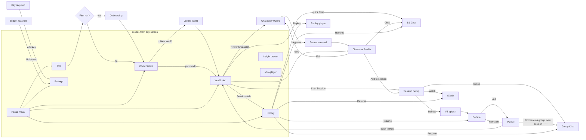

# 03: Screens & Flows

Baseline canvas: **1440×900**. Every layout must also work at the **1280×720 minimum** (APP-06). Desktop only.

## 1. Screens

| ID | Screen | Purpose | Key components | Stories |
|---|---|---|---|---|
| S01 | Title | Brand moment, audio unlock | Kinetic logo, "Press any key", version tag | APP-01 |
| S02 | Onboarding | 3 intro cards + key prompt | Card carousel, key field, "Explore demo first" | APP-04 |
| S03 | World Select | Choose or create a world | Tilted world cards, + New World card, pause-menu button | WLD-01/02 |
| S04 | World Hub | Roster and sessions for one world | Cover header, Roster / Sessions tabs, character cards, Archived filter (Restore / Delete permanently), + New Character, Start Session | WLD-05, PRF-06 |
| S05 | Character Wizard | Create or edit a character | Step rail; S05a Seed · S05b Profile · S05c Look · S05d Portrait · S05e Emotions · S05f Palette · S05g Theme · S05h Approve | CHR-* |
| S06 | Character Profile | View or edit a character | Animated portrait card + energy panel; tabs Profile / Gallery / Theme / Sessions / Memory / Knowledge; CTAs | PRF-*, ENG-* |
| S07 | 1:1 Chat | Chat with one character | Portrait card, name plate + **energy bar**, rush-hour chip, AUTO/MANUAL, emotion picker, log, input, mini-player, cost HUD, Insight button, SME tape | CHAT-*, ENG-* |
| S08 | Session Setup | Configure a multi-character session | Mode cards → cast picker → mode config → Start | MULTI-01/05/09 |
| S09 | Group Chat | Multi-character conversation | Portrait row (portrait menu O24), NEXT ▸ chip, log, responder dropdown, music selector, @mention input, Everyone answer | MULTI-02/03/04/17 |
| S10 | Debate | Moderated debate | Motion banner, side columns, timeline rail, steering bar, log | MULTI-06/07 |
| S11 | Verdict | Debate outcome | "You decide" pick step (when applicable), Stronger-case / Your call / Too close to call reveal, rubric bars, summary, key disagreement, actions | MULTI-08 |
| S12 | Watch (Theater) | Characters talk among themselves | Stage, transport bar, Step in, Director's note, episode counter | MULTI-09/10/11 |
| S13 | History | Sessions in a world | Filter bar, session rows, Replay / Resume / Rename / Delete / Export | HIST-*, MULTI-15 |
| S14 | Settings | Configuration | Tabs: Connection / Audio / Chat / Display / Models / **Cost (generation mode, caps, default energy, spend view)** / Data / About | SET-* |

## 2. Overlays & modals

| ID | Overlay | Trigger |
|---|---|---|
| O01 | Pause menu | `Esc` / corner button |
| O02 | Create / Edit World (name, cover, **"You in this world" card**) | + New World / ⋯ |
| O03 | Destructive confirmation | **Typed:** delete world, permanently delete character, delete all data. **Simple confirm:** delete a session |
| O04 | Cost confirmation | First generation per app launch |
| O05 | Key required | AI action without a key |
| O06 | Emotion lightbox | Gallery or emotion-slot click |
| O07 | Emotion picker | MANUAL mode |
| O08 | **Insight drawer** | `I` / header button |
| O09 | Mini-player popover | Mini-player click |
| O10 | Backlog (full-screen log) | `L` |
| O11 | Mention picker | `@` in input |
| O12 | Ask… / Interject / Director's note composer | Steering and Watch controls |
| O13 | Unsaved draft prompt | Leaving the wizard |
| O14 | Toast stack | System events |
| O15 | Summon reveal | Approve character |
| O16 | VS splash / Round banner | Debate start / phase change |
| O17 | Episode-end card | Watch length reached |
| O18 | Mock State Switcher (dev) | `Ctrl+Shift+D` |
| O19 | Desktop guard | Viewport < 1280×720 |
| O20 | Keyboard shortcuts | `?` |
| O21 | Budget reached | Cap hit (STATE-06) |
| O22 | Demo-mode tape | No key (persistent, top) |
| O23 | Replay transport + REPLAY badge | Replaying a session (renders **inside** S07/S09/S10/S12 with this transport on top) |
| O24 | Portrait menu | Click or right-click a stage portrait (MULTI-17) |
| O25 | Old / New asset comparison | Regenerated asset on an approved character (PRF-03) |
| O26 | End debate early | "End debate" before closing (MULTI-07) |
| O27 | **Energy top-up** ("Give {name} +500 ⚡ (≈ US$0.05)?") | Top up from an exhausted note, energy bar or profile (ENG-05) |

## 3. Navigation map



## 4. Key user flows

### F1: First run, no key (demo mode)
Title → Onboarding ("Explore demo first") → World Select (DEMO tape) → *Meridian Council* → History → **Replay** "Four-day work week" debate (with Insight drawer) → Settings → paste key → tape disappears.

### F2: Create a character
Hub → + New Character → Seed ("Sarah, a doctor", Intent: Expert) → Draft (fields reveal) → edit Profile → Look (chips pre-selected) → Generate 2 candidates (cost confirm) → pick + optional Tweak → Generate emotions (Variant B or C) → fix one slot ("Doesn't look like them") → Palette (live preview) → Theme brief → Compose (background) → Approve → Summon reveal → Profile.

### F3: 1:1 chat
Profile → Chat → greeting → send → "…" + lean-in → emotion arrives → stream → crossfade + VFX → energy bar ticks "−4 ⚡" → Insight drawer for that message → switch to MANUAL → set "embarrassed" (face only) → Stop mid-stream → Regenerate (‹1/2›).

### F4: Debate
Hub → Start Session → DEBATE → pick 3 → Two sides (drag) → Standard → Moderator: You → Verdict: Arbiter → Start → VS → rounds with reactions → Ask… Mei → Interject → Skip to closing → Verdict → Export Markdown → Continue as group chat (new session).

### F5: Watch
Hub → Start Session → WATCH → pick 2–3 → premise → 20 turns, Normal pace → Start → Director's note → Step in → "Resume the scene" → Episode end → Continue +10 / Summarise.

### F5b: Energy
Open Sunny Hollow → Rin's bar is red (Tired, yawning) → group chat → Rin replies and her bar drains to 0 → Rin falls asleep (Zzz) → next turn: "Rin is asleep, skipping." → @Rin → inline note with Top up → O27 confirm → recharge animation → Rin replies.

### F6: Failure & budget paths (must all be reviewable via O18)
Image partial failure → retry slot · Song failure → approve without song · Rate limited with countdown · Budget reached mid-debate → modal → Raise cap → resume · Stream cut → Continue.

## 5. Reference layouts

**S07 1:1 Chat**
```
┌───────────────────────────────────────────────────────────────────────────┐
│ ◂  ▰ HANA MORISAKI ▰   AUTO|MANUAL  Readable  ♪ Hana's Theme ▮▮  $0.004  ⓘ │
│ ╱ AI simulation · not professional advice (only if advisory) ╱             │
│ ⚡▰▰▰▰▰▰▱▱ 640/1000   RUSH HOUR · 2× ⚡ (only at peak)                        │
├──────────────────────────────┬────────────────────────────────────────────┤
│░░ palette stage band (14°) ░░│ ╲  log panel (diagonal left edge)           │
│        ┌──────────┐          │  Hana  ▸ Welcome back!! I saved you…        │
│        │ PORTRAIT │  [emo    │                     You ▸ What did you do?  │
│        │  ~42% w  │  picker  │  Hana  ▸ ▌streaming…                        │
│        │  card,   │  strip in│                                             │
│        │  bottom  │  MANUAL] │                                             │
│        └──────────┘          │ ┌────────────────────────────────┐ ▱SEND▱   │
└──────────────────────────────┴─┴────────────────────────────────┴──────────┘
```
- The **framed portrait card** (opaque, doc 04 §4) takes the left ~42% and is cropped by the bottom edge, on a palette-tinted diagonal band. The energy bar sits under the name plate. The name plate is skewed −8° and overlaps the portrait.
- The log panel's left edge is cut on the diagonal. Long messages switch to the straight Readable panel.
- Send is a skewed parallelogram that becomes a Stop square while streaming.

**S10 Debate**
```
┌───────────────────────────────────────────────────────────────────────────┐
│        ███ MOTION: THIS HOUSE WOULD ADOPT A FOUR-DAY WORK WEEK ███         │
│   OPENING ● ── REBUTTAL ◉ ── CLOSING ○        NEXT ▸ MEI                   │
├──────────────┬──────────────────────────────────────────┬─────────────────┤
│ PROPOSITION  │            centre log column             │  OPPOSITION     │
│ [Amara] [Vic]│  ROUND 2 · OPP · Mei ▸ Honestly? Nobody… │      [Mei]      │
│  (speaker    │                                          │  (slides 40px   │
│   slides in) │                                          │   to centre)    │
├──────────────┴──────────────────────────────────────────┴─────────────────┤
│ ❚❚  Next  Ask…  Interject  Extend  Skip to closing  End  │ auto-advance ● │
└───────────────────────────────────────────────────────────────────────────┘
```

**S09 Group / S12 Watch:** portraits in a row along the bottom third, with the log in a centred column above. With 5 participants at 1280×720, each portrait is at least 38% of the viewport height, overlapping slightly. Watch uses a "script" log style (speaker name in small caps, no bubbles, stage directions as tapes). Its transport bar replaces the input.

**S10 with 3+ debaters per side:** at most 2 portraits side by side per column; a third stacks behind at 80% scale. The speaker always comes to the front.

**Auto host (S10):** no portrait. A "HOST" name plate on a `horizon-500` tape sits directly under the motion banner.

**S05 Wizard, Look step:** the Spec card on the left (portrait or silhouette, palette frame, "Changes apply on Generate" badge); category tabs and chips on the right; Appearance summary + Extra details at the bottom; "Generate portrait ▸ ≈ $0.06" bottom-right.

## 6. Keyboard shortcuts

**Rule (APP-10):** single-key shortcuts (`I`, `L`, `?`, `Space`, `→`) fire **only when focus is not in a text field**.

| Key | Action |
|---|---|
| `Esc` | Pause menu / close overlay |
| `I` | Insight drawer |
| `L` | Backlog |
| `?` | Shortcuts sheet |
| `Alt+1`…`Alt+7` | Set face (MANUAL); works while typing |
| `Space` | Pause / resume (Debate, Watch, Replay) |
| `→` | Next turn / Step |
| `@` | Mention picker |
| `Enter` / `Shift+Enter` | Send / new line (composer) |
| `Ctrl+Enter` | Send (alias) |
| `Ctrl+Shift+D` | Mock State Switcher (UI phase) |
